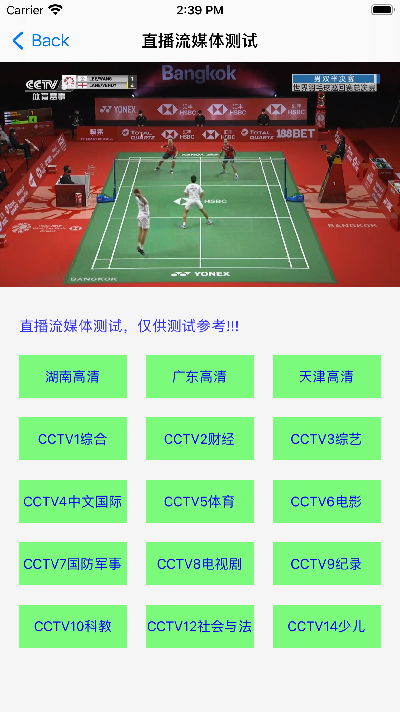
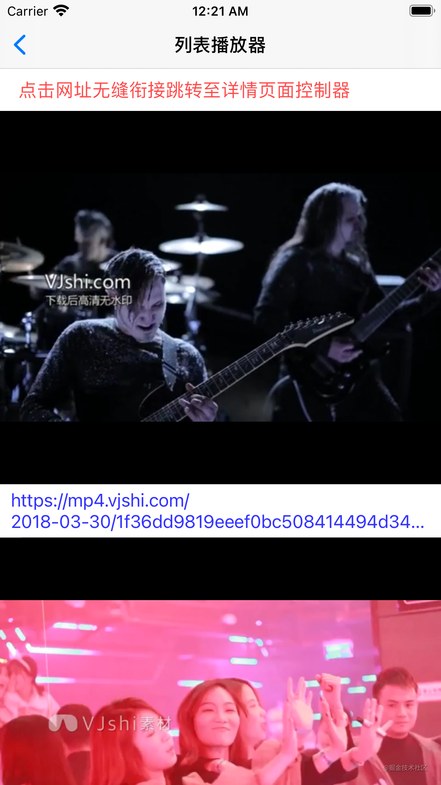

# KJPlayer

### 功能介绍
**动态切换内核，支持边下边播的播放器方案**   

* 支持音/视频播放，midi文件播放  
* 支持在线播放/本地播放
* 支持后台播放，音频提取播放  
* 支持视频边下边播，分片下载播放存储
* 支持断点续载续播，下次直接优先从缓冲读取播放
* 支持缓存管理，清除时间段缓存
* 支持试看，自动跳过片头片尾
* 支持记录上次播放时间
* 支持自动播放，自动连续播放
* 支持随机/重复/顺序播放
* 支持重力感应，全屏/半屏切换
* 支持基本手势操作，进度音量等
* 支持锁定屏幕
* 长按快进快退等操作
* 支持倍速播放
* 支持切换不同分辨率视频  
* 支持直播流媒体播放  
* 持续更新ing...

----------------------------------------
> 视频支持格式：mp4、m3u8、wav、avi  
> 音频支持格式：midi、mp3、

----------------------------------------

### 效果图
|  |  |
| --- | --- |

### 免费试看功能
- 该功能类似于Vip会员观看性质，充值之后继续播放观看模式

```swift
// MARK: - KJPlayerFreeDelegate
extension DetailsViewController: KJPlayerFreeDelegate {
    /// 获取免费试看时间
    /// - Parameter player: 播放器内核
    /// - Returns: 试看时间，返回零不限制
    func kj_freeLookTime(with player: KJBasePlayer) -> TimeInterval {
        return 50
    }
    
    /// 试看结束响应
    /// - Parameters:
    ///   - player: 播放器内核
    ///   - currentTime: 当前播放时间
    func kj_freeLookTime(with player: KJBasePlayer, currentTime: TimeInterval) {
        
    }
}
```
- 充值之后恢复观看权限

```swift
self.player.kj_closeFreeLookTimeLimit()
```

### 跳过片头片尾功能
- 该功能很明确就是类似于观看视频跳过片头和片尾功能

```swift
// MARK: - KJPlayerSkipDelegate
extension DetailsViewController: KJPlayerSkipDelegate {
    /// 跳过片头
    /// - Parameter player: 内核
    /// - Returns: 需要跳过的时间
    func kj_skipOpeningTime(with player: KJBasePlayer) -> TimeInterval {
        return 18
    }
    
    /// 跳过片头响应
    /// - Parameters:
    ///   - player: 内核
    ///   - openingTime: 跳过播放时间
    func kj_skipOpeningTime(with player: KJBasePlayer, openingTime: TimeInterval) {
        self.backview.hintTextLayer.kj_displayHintText("跳过片头，自动播放",
                                                       time: 5,
                                                       position: KJPlayerHintPositionBottom)
    }
}
```

### 记忆播放功能
- 该功能会自动记忆上次播放时间，下次直接无缝开始继续播放
- 备注提示：该功能大于跳过片头功能，简单讲就是该功能实现之后下次会直接从上次播放位置开始继续观看

```swift
// MARK: - KJPlayerRecordDelegate
extension DetailsViewController: KJPlayerRecordDelegate {
    /// 获取是否需要记录响应
    /// - Parameter player: 播放器内核
    /// - Returns: 是否需要记忆播放
    func kj_recordTime(with player: KJBasePlayer) -> Bool {
        return true
    }
    
    /// 获取到上次播放时间响应
    /// - Parameters:
    ///   - player: 播放器内核
    ///   - lastTime: 上次播放时间
    func kj_recordTime(with player: KJBasePlayer, lastTime: TimeInterval) {
        
    }
}
```
- 主动选择储存记忆

```swift
self.player.kj_saveRecordLastTime()
```

|✌️

----

##### **总结：先把基本的壳子完善，后面再慢慢来补充其他的内核，如若觉得有帮助请帮忙点个星，有什么问题和需求也可以Issues**

### 关于作者
- 🎷 **邮箱地址：[ykj310@126.com](ykj310@126.com) 🎷**
- 🎸 **GitHub地址：[yangKJ](https://github.com/yangKJ) 🎸**
- 🎺 **掘金地址：[茶底世界之下](https://juejin.cn/user/1987535102554472/posts) 🎺**
- 🚴🏻 **简书地址：[77___](https://www.jianshu.com/u/c84c00476ab6) 🚴🏻**

**救救孩子吧，谢谢各位老板。**

🥺

-----
